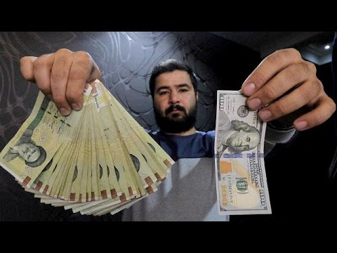
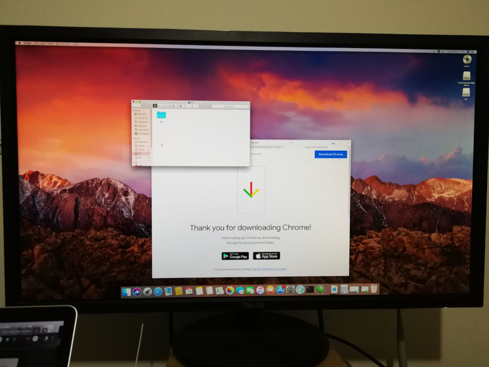

Hello everybody, this is my first blog and I would like to try it with Gatsby so here it is.
If you see mistakes on my blog please let me know, as my English is not as good as native ones ,although I am improving the English language constantly. Let's go!

## Preface

Currently I am a junior android developer, but I have studied a Civil Engineering BSc at a small college as I believe it was just goofing off 5 fucking years and finally I found out I wasn't into it. Therefore, I left it behind to cut my losses and open new doors as a programmer instead of being a civil engineer. I have tried to learn android programming at a company that its main business is providing clean and safe Internet content for Kids and teens.
After 5 months' working as an internship I was suggested a permanent contract which was the beginning journy of my professional career as an android developer. I should confess I was speechless and you coulda knocked me down with a feather.

## Beginning of the story

After working about a year and a half I have been assigned a project that I shoulda written in React Native from scratch. I was so excited cuz I've had a chance to learn and experience many new materials which was appealing to code once and see the result both in android and ios simultaneously.

After couple months' working on the project I made up my mind to learn Swift and native ios, so that to be able to get better understanding of what I am doing on the ios side and if it is needed, create native modules for the project.

As most of you know, learning ios is an expensive stuff. You must have a MacBook or iMac as well as an iphone for running and testing purposes. In fact, an ios simulator covers most of what you really need
 and you can use it instead of iphone, though having a mac device is necessary cuz you need XCode to development which is available only on macOS. As to crashing Iran's Rial, each dollar comes to about 110,000 Rials and needless to say I cannot afford to buy a MacBook.

 

 I had to borrowed the company's MacBook and in return I gave a 300,000,000 Rials promissory note which comes to around my 1.5 years income.
 Every day and night I'd put it in my backpack and take home which is exhausting and risky. Furthermore, it is likly I get it stolen or other unforseen accidents.

 ## The Big Decision
 
 I bought a high spec PC when the inflation rate in Iran was lower than now. To decrease the risk of lossing the Macbook based on aforementioned argumanets, I've searched on the Internet how can I install mcOS on a non-MacBook device like my pc,then I've found how it is possible to install Hackintosh which was a great solution.
 
 Firstly, I've downloaded the High Sierra installer from a Persian website.
 I've tried to boot it into a USB stick by [UniBeast](http://www.tonymacx86.com/resources/unibeast-8-3-2-high-sierra.383/)
 but I failed.
 Honestly, I didn't know what was wrong with the downloaded image. I knew that one of my colleagues had a newer version (Mojave) so I got the Mojave installer from him and tried again, [Step By Step Process To Install Hackintosh macOS Mojave](http://techhowdy.com/process-to-install-hackintosh-macos-mojave/) but it didn't work as previous time.

 I watched [This](https://www.youtube.com/watch?v=VdRSYogDygs) guidance on the Youtube website, then I've installed it successfully onto my PC. I was over the moon at first but all of a sudden I found out Nvidia's driver doesn't support Mojave yet. The display resolution was very low and none of installed browsers worked correctly which was disappointing time.

 I've had two options: 

 1. Wait until Nvidia release the driver for Mojave
 2. Downgrade to High Sierra version
   
I went for the later which was logical.

Thanks to my colleague advice I downloaded an authentic High Sierra image from [here](https://p30download.com/fa/entry/75015/).

I tried some of youtubers' guidance but there was no success.

Finally I've found this [article](https://hackintosher.com/guides/high-sierra-install-full-guide/) and followed the instructions step by step that led me to install a High Sierra OS with no problem and drivers as well.

And this is the result of my fortnight's try and error to get what I'd been looking for: 

If you wanna try it too, pay attention the contents of the EFI folder in boot loader which is paramount. If you set it up improperly, your installation process will fail. Carry it out exactly as I did.

For Intel CPU systems if AppleCDA.kext or AppleHDA.kext sound driver doesn't work, download VoodooHDA clover from the [direct link](https://github.com/chris1111/VoodooHDA-2.9.0-Clover-V12/files/2087523/VoodooHDA.2.9.0.Clover-V12.zip).
then install and restart your pc.

OK guys! have a good luck.